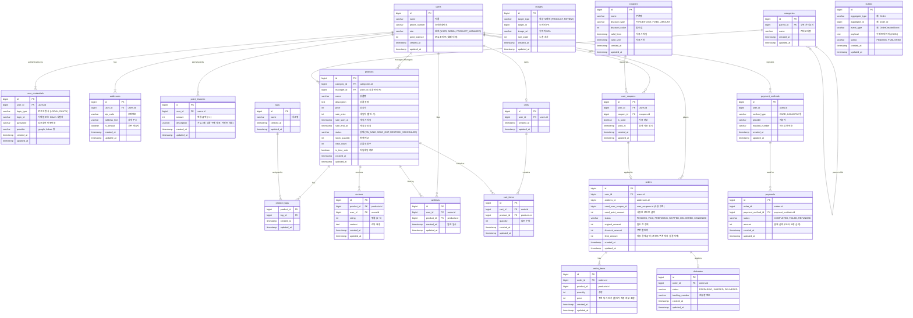

# E-commerce-clone-coding

---

[구현 계획](./docs/implmentation_plan.md)

---

 데이터베이스 다이어그램 (Mermaid)

```mermaid
erDiagram
    %% =======================
    %% 1. User & Auth Module
    %% =======================
    users {
        bigint id PK
        varchar name "이름"
        varchar phone_number "휴대전화번호"
        varchar role "권한 (USER, ADMIN, PRODUCT_MANAGER)"
        int point_balance "보유 포인트 (화폐 대체)"
        timestamp created_at
        timestamp updated_at
    }

    user_credentials {
        bigint id PK
        bigint user_id FK "users.id"
        varchar login_type "로그인 방식 (LOCAL, OAUTH)"
        varchar login_id "이메일 또는 OAuth 식별자"
        varchar password "암호화된 비밀번호"
        varchar provider "google, kakao 등"
        timestamp created_at
        timestamp updated_at
    }

    addresses {
        bigint id PK
        bigint user_id FK "users.id"
        varchar zip_code "우편번호"
        varchar address_line "상세 주소"
        boolean is_default "기본 배송지"
        timestamp created_at
        timestamp updated_at
    }

    point_histories {
        bigint id PK
        bigint user_id FK "users.id"
        int amount "변동 금액 (+/-)"
        varchar description "사유 (예: 상품 구매 사용, 이벤트 적립)"
        timestamp created_at
        timestamp updated_at
    }

    %% =======================
    %% 2. Common/Media Module
    %% =======================
    images {
        bigint id PK
        varchar target_type "대상 도메인 (PRODUCT, REVIEW)"
        bigint target_id "도메인 PK"
        varchar image_url "이미지 URL"
        int sort_order "노출 순서"
        timestamp created_at
        timestamp updated_at
    }

    %% =======================
    %% 3. Catalog & Inventory Module
    %% =======================
    categories {
        bigint id PK
        bigint parent_id FK "상위 카테고리"
        varchar name "카테고리명"
        timestamp created_at
        timestamp updated_at
    }

    products {
        bigint id PK
        bigint category_id FK "categories.id"
        bigint manager_id FK "users.id (상품 관리자)"
        varchar name "상품명"
        text description "상품 설명"
        int price "정상가"
        int sale_price "세일가 (할인 시)"
        timestamp sale_start_at "세일 시작일"
        timestamp sale_end_at "세일 종료일"
        varchar status "상태 (ON_SALE, SOLD_OUT, RESTOCK_SCHEDULED)"
        int stock_quantity "현재 재고"
        int view_count "상품 조회수"
        boolean is_time_sale "타임세일 여부"
        timestamp created_at
        timestamp updated_at
    }

    tags {
        bigint id PK
        varchar name "태그명"
        timestamp created_at
        timestamp updated_at
    }

    product_tags {
        bigint product_id FK
        bigint tag_id FK
        timestamp created_at
        timestamp updated_at
    }

    reviews {
        bigint id PK
        bigint product_id FK "products.id"
        bigint user_id FK "users.id"
        int rating "평점 (1~5)"
        text content "리뷰 내용"
        timestamp created_at
        timestamp updated_at
    }

    wishlists {
        bigint id PK
        bigint user_id FK "users.id"
        bigint product_id FK "products.id"
        timestamp created_at "찜한 일시"
        timestamp updated_at
    }

    %% =======================
    %% 4. Coupon Module
    %% =======================
    coupons {
        bigint id PK
        varchar name "쿠폰명"
        varchar discount_type "PERCENTAGE, FIXED_AMOUNT"
        int discount_value "할인 값"
        timestamp valid_from "사용 시작일"
        timestamp valid_until "사용 기한"
        timestamp created_at
        timestamp updated_at
    }

    user_coupons {
        bigint id PK
        bigint user_id FK "users.id"
        bigint coupon_id FK "coupons.id"
        boolean is_used "사용 여부"
        timestamp used_at "실제 사용 일시"
        timestamp created_at
        timestamp updated_at
    }

    %% =======================
    %% 5. Cart Module
    %% =======================
    carts {
        bigint id PK
        bigint user_id FK "users.id"
        timestamp created_at
        timestamp updated_at
    }

    cart_items {
        bigint id PK
        bigint cart_id FK "carts.id"
        bigint product_id FK "products.id"
        int quantity "담은 수량"
        timestamp created_at
        timestamp updated_at
    }

    %% =======================
    %% 6. Order & Delivery Module
    %% =======================
    orders {
        bigint id PK
        bigint user_id FK "users.id"
        bigint address_id "addresses.id"
        bigint used_user_coupon_id "user_coupons.id (사용 쿠폰)"
        int used_point_amount "사용한 포인트 금액"
        varchar status "PENDING, PAID, PREPARING, SHIPPED, DELIVERED, CANCELED"
        int original_amount "할인 전 총액"
        int discount_amount "쿠폰 할인액"
        int final_amount "최종 결제 금액 (포인트/쿠폰 제외 실 결제액)"
        timestamp created_at
        timestamp updated_at
    }

    order_items {
        bigint id PK
        bigint order_id FK "orders.id"
        bigint product_id "products.id"
        int quantity "수량"
        int price "주문 당시 단가 (할인가 적용 여부 포함)"
        timestamp created_at
        timestamp updated_at
    }

    deliveries {
        bigint id PK
        bigint order_id FK "orders.id"
        varchar status "PREPARING, SHIPPED, DELIVERED"
        varchar tracking_number "운송장 번호"
        timestamp created_at
        timestamp updated_at
    }

    %% =======================
    %% 7. Payment Module
    %% =======================
    payment_methods {
        bigint id PK
        bigint user_id "users.id"
        varchar method_type "CARD, KAKAOPAY 등"
        varchar provider "제공사"
        varchar masked_number "마스킹된 번호"
        timestamp created_at
        timestamp updated_at
    }

    payments {
        bigint id PK
        bigint order_id "orders.id"
        bigint payment_method_id FK "payment_methods.id"
        varchar status "COMPLETED, FAILED, REFUNDED"
        int amount "결제 금액 (PG사 요청 금액)"
        timestamp created_at
        timestamp updated_at
    }

    %% =======================
    %% 8. Outbox (Transaction)
    %% =======================
    outbox {
        bigint id PK
        varchar aggregate_type "예: Order"
        bigint aggregate_id "예: order_id"
        varchar event_type "예: OrderCreatedEvent"
        text payload "이벤트 데이터 (JSON)"
        varchar status "PENDING, PUBLISHED"
        timestamp created_at
        timestamp updated_at
    }

    %% Relationships Definition
    users ||--|{ user_credentials : "authenticates via"
    users ||--|{ addresses : "has"
    users ||--o{ point_histories : "earns/spends"
    users ||--o{ wishlists : "likes"
    products ||--o{ wishlists : "liked by"
    users ||--o{ products : "manages (Manager)"
    users ||--o{ orders : "places"
    users ||--o{ user_coupons : "owns"
    coupons ||--o{ user_coupons : "issued as"
    categories ||--o{ categories : "parent-child"
    categories ||--|{ products : "contains"
    products ||--o{ product_tags : "has"
    tags ||--o{ product_tags : "assigned to"
    products ||--o{ reviews : "receives"
    users ||--o| carts : "owns"
    carts ||--o{ cart_items : "contains"
    products ||--o{ cart_items : "added as"
    orders ||--|{ order_items : "has"
    orders ||--o| deliveries : "requires"
    user_coupons ||--o| orders : "applied to"
    users ||--o{ payment_methods : "registers"
    payment_methods ||--o{ payments : "used for"
```

