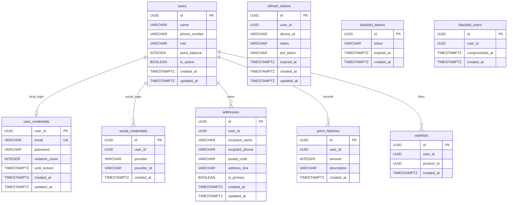
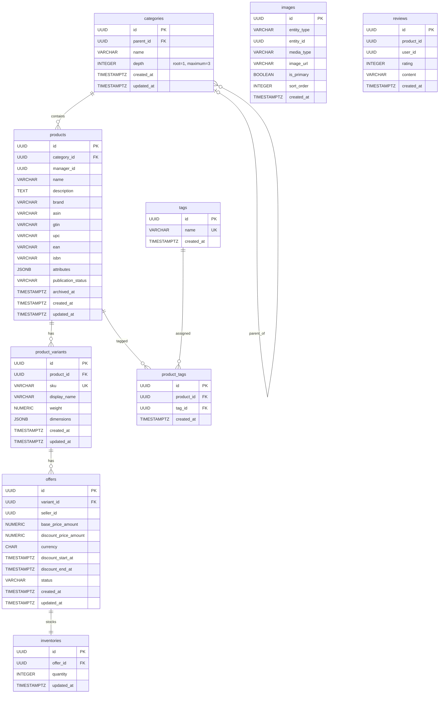
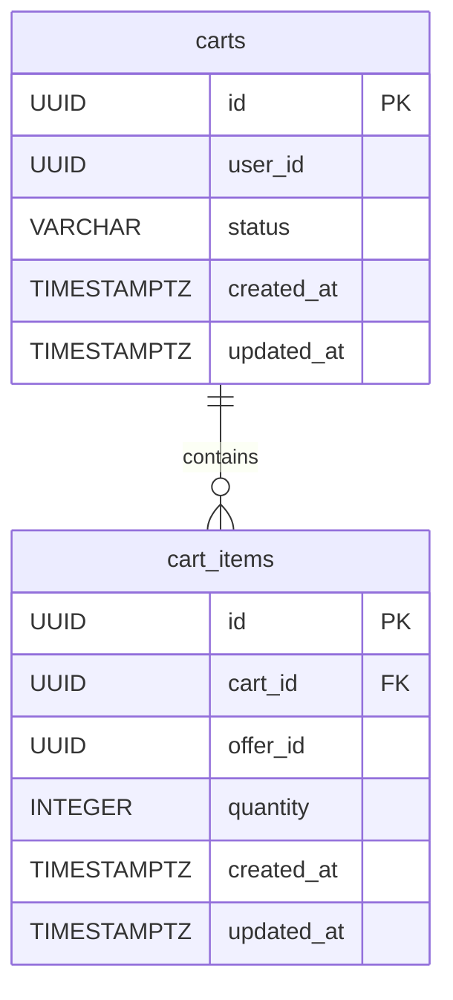
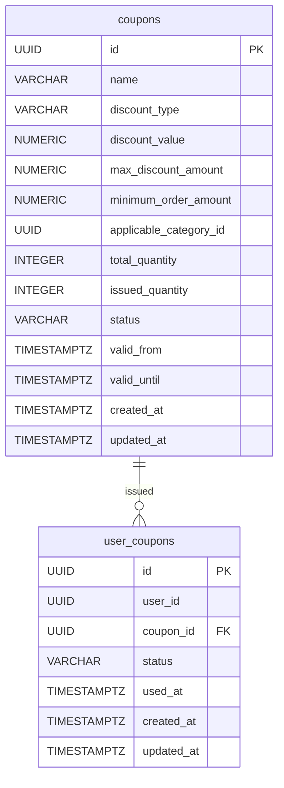
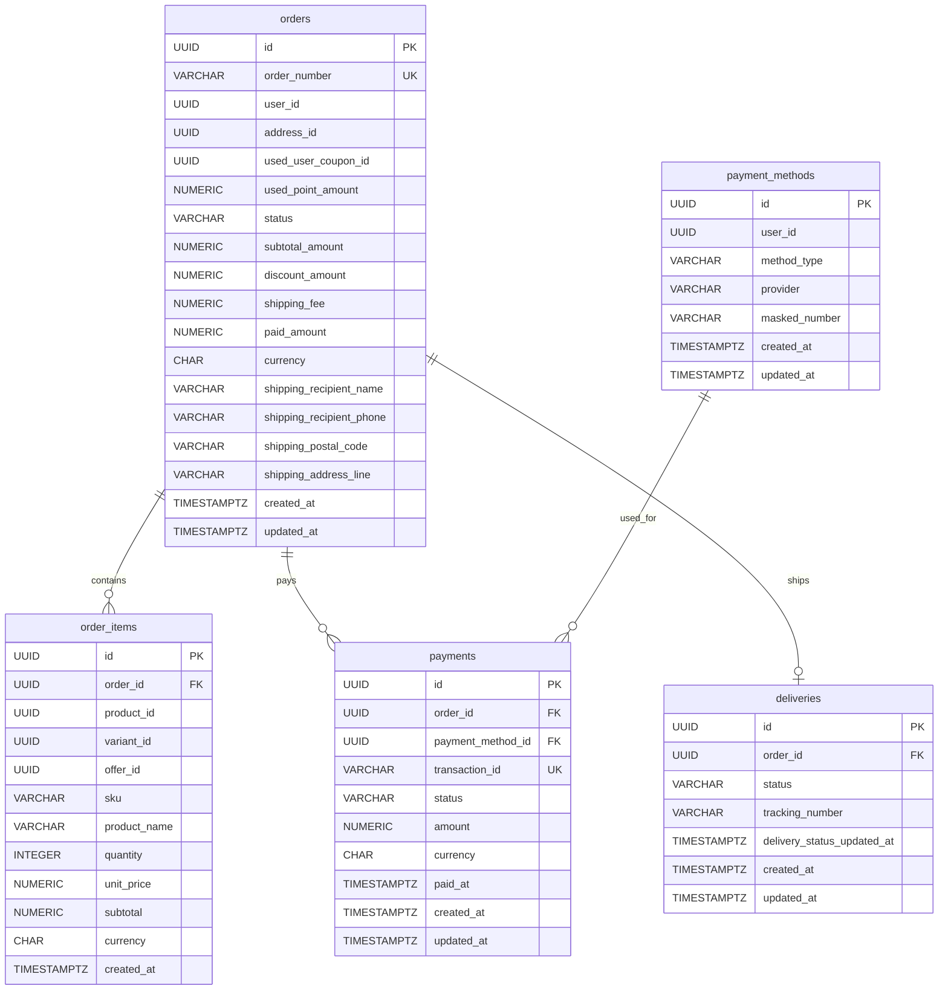
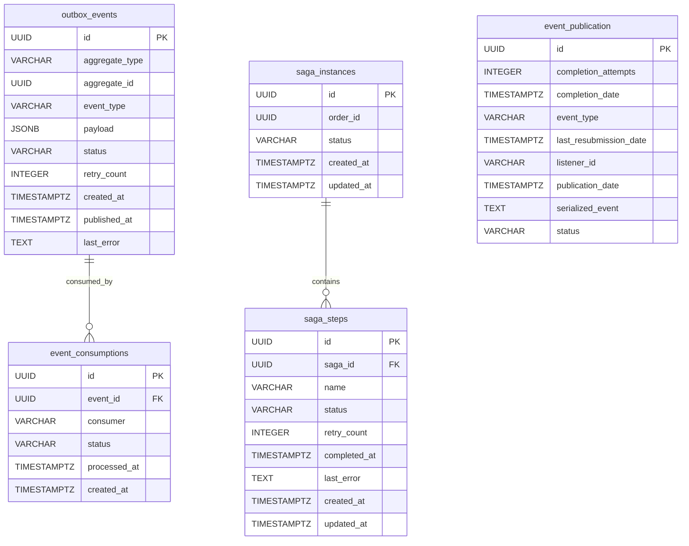
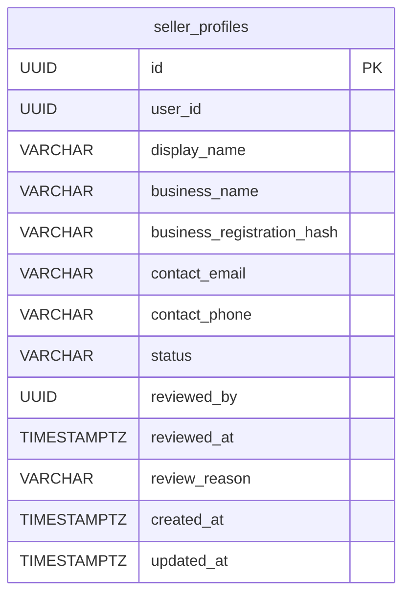

# E-commerce-clone-coding

요구사항과 구현 문서는 [문서 인덱스](./docs/index.md)에서 확인할 수 있습니다. 기본 데이터베이스 스키마는 [`V1__init_schema.sql`](./src/main/resources/db/migration/V1__init_schema.sql)에 정의되어 있습니다.

## 기본 스키마

심화사항을 제외한 P1~P8 요구사항의 테이블을 영역별로 나누었습니다. 모든 식별자는 UUID입니다. 모듈 간 식별자에는 DB FK를 만들지 않고 애플리케이션 계약으로 검증합니다.

P1 User & Auth

P2 Catalog & Inventory

P3 Cart

P4 Coupon

P5 Order, Payment & Delivery

P6 Outbox & Saga

P7 Admin & Operations

P7은 별도 업무 데이터를 소유하지 않습니다. P2~P6의 공개 application interface를 통해 관리자 전용 기능과 운영·재처리를 제공합니다.

P8 Seller & Marketplace

`products.manager_id`는 상품을 등록·관리한 `users.id`를 가리키는 모듈 간 논리 참조입니다. `offers.seller_id`는 Offer를 소유한 P8의 `seller_profiles.id`를 가리키며, 플랫폼 기본 Offer에서는 `NULL`입니다. 두 값 모두 모듈 간 논리 참조이므로 DB FK는 생성하지 않습니다.
