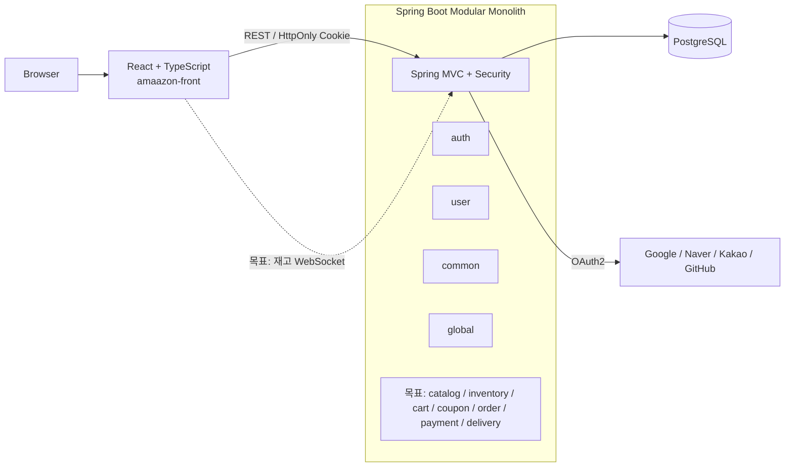
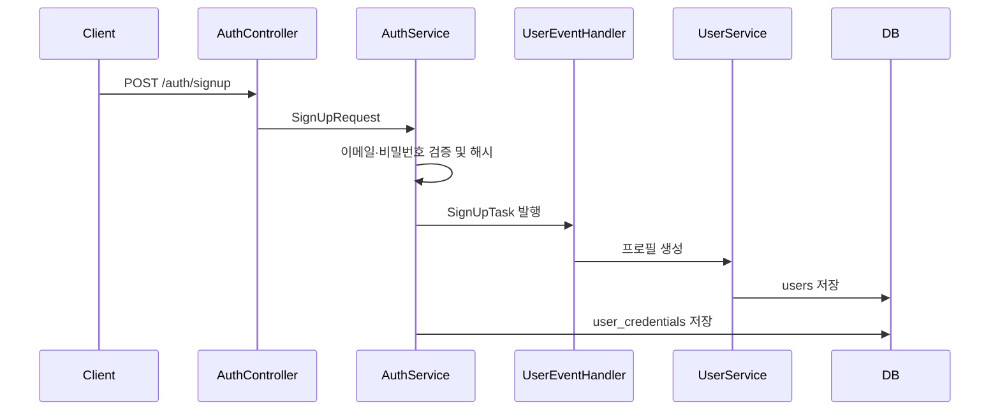

# 아키텍처

## 목적과 범위

하나의 Spring Boot 배포 단위 안에서 도메인별 변경과 검증을 지역화하는 모듈러 모놀리스를 구축한다. 모듈은 작은 공개 인터페이스 뒤에 비즈니스 규칙과 저장 세부사항을 숨기고, 향후 MSA 전환 시 모듈 seam을 서비스 seam으로 발전시킬 수 있어야 한다.

이 문서는 `docs/requirement/index.md`의 목표 구조와 장기간 유지할 구조 원칙을 설명한다. 브랜치, Git SHA, 구현 완료 범위처럼 자주 바뀌는 정보는 `docs/current-state.md`에서 관리한다.

구조, 모듈 seam, 허용 의존성이 바뀔 때만 이 문서를 갱신한다. 선택 이유는 이 문서에 누적하지 않고 ADR에 기록한다.

## 시스템 구성



- 백엔드: Java 17, Spring Boot 3.5.16, Spring Modulith 1.4.12, Spring Data JPA, Flyway, Spring Security.
- 데이터베이스: PostgreSQL. 테스트 환경은 Testcontainers 사용을 전제로 한다.
- 프론트엔드: React 19, TypeScript, Vite, React Router, React Hook Form, Zod.
- 배포 모델: 현재 백엔드와 프론트엔드는 별도 프로젝트 디렉터리지만 백엔드는 하나의 프로세스와 하나의 DB를 사용하는 모듈러 모놀리스다.

## 저장소 구조

```text
src/main/java/io/github/metdaisy/amaazon/
  auth/       인증 수단, 로그인, JWT 연계
  user/       사용자 프로필과 역할
  common/     모듈 공통 타입과 기반 인터페이스
  global/     보안·웹·캐시·예외·Outbox 기반 설정
src/main/resources/
  db/migration/   Flyway 스키마
src/test/         백엔드 테스트
amaazon-front/    React 프론트엔드
docs/             요구사항, 설계, 상태 문서
```

## 모듈 내부 구조

도메인 모듈은 다음 책임을 따른다.

| 영역 | 책임 |
|---|---|
| `presentation` | HTTP 요청·응답, 인증 주체 추출, 입력 검증 진입점 |
| `application` | 유스케이스 조정, 트랜잭션, 공개 port와 이벤트 처리 |
| `domain` | 엔티티, 값과 상태 전이, 도메인 오류, 저장소 인터페이스 |
| `infra` | JPA, 외부 시스템, 보안 프레임워크 등의 adapter |

호출자는 모듈의 공개 인터페이스만 알아야 한다. JPA 엔티티나 다른 모듈의 `infra` 구현을 직접 참조하지 않는다.

## 현재 모듈과 공개 seam

`package-info.java`에 선언된 현재 허용 의존성은 다음과 같다.

| 모듈 | 책임 | 허용 의존성 |
|---|---|---|
| `common` | 공통 인증 주체, 저장소·매퍼·예외 기반 타입 | 없음 |
| `global` | Spring 설정, 공통 보안/JWT, 캐시, 웹 필터, Outbox 기반 | `common::*` |
| `auth` | 로컬·소셜 인증수단, 토큰, 블랙리스트, 회원가입 진입점 | `common::*`, `user::event`, `user::user-api`, `global::jwt`, `global::blacklist` |
| `user` | 프로필, 역할, 활성 상태 | `common::*`, `auth::signup`, `auth::password` |

현재 공개된 주요 `@NamedInterface`는 다음과 같다.

- `user::user-api`: 인증 모듈이 사용자 존재 여부, 역할, 활성 상태를 조회하는 동기 seam.
- 역할은 `USER`(기본 구매자), `PRODUCT_MANAGER`(판매자), `ADMIN`(플랫폼 운영자)으로 구분한다. `PRODUCT_MANAGER`도 구매자 API를 사용할 수 있으며, 판매자 API는 활성 `Seller`을 추가로 요구한다.
- `auth::signup`: `SignUpTask`를 통해 프로필 생성을 요청하는 현재 회원가입 seam.
- `auth::password`: 회원가입 요청의 비밀번호 검증 규칙.
- `global::jwt`: JWT 설정과 생성·검증 기능.
- `global::blacklist`: 토큰 무효화 이벤트.

## 현재 회원가입 흐름



- 평문 비밀번호는 `auth` 요청과 검증·해시 범위에 머물며 `SignUpTask`에는 포함되지 않는다.
- Spring의 기본 `@EventListener`는 동기 실행이므로 현재 프로필과 인증수단 생성은 발행자 트랜잭션에 결합되어 있다.
- `SignUpTask`는 완료 사실보다 프로필 생성을 지시하는 명령 성격이 강하다. 이를 유지할지 동기 인터페이스 seam으로 바꿀지는 ADR로 확정해야 한다.
- `auth`와 `user`가 서로의 Named Interface에 의존하므로 새 의존성을 추가하기 전에 순환을 더 키우지 않는지 확인해야 한다.

## 목표 도메인 모듈

| 단계 | 목표 모듈 | 핵심 책임 |
|---|---|---|
| P1 | `user`, `auth` | 프로필, 인증수단, 권한, 주소, 포인트, 관심상품 |
| P2 | `catalog`, `inventory`, `review` | 카테고리, CatalogProduct·ProductVariant, 이미지, 검색, 가격·재고 규칙, 리뷰 |
| P3 | `cart` | 활성 장바구니, 항목과 수량, 결제 전 재검증 |
| P4 | `coupon` | 쿠폰 발행·보유·사용·만료 |
| P5 | `order`, `payment`, `delivery` | 금액 산출, 상태 머신, 결제와 환불, 배송 추적 |
| P6 | `outbox`와 Saga 참여 모듈 | 이벤트 유실 방지, 재시도, 멱등 소비, 보상 트랜잭션 |
| P7 | 관리자·운영 진입점 | 관리자 전용 API, 권한 변경, 운영·재처리 기능 |
| P8 | `seller` | 판매자 온보딩, Seller, Offer 관리·재고 조정·판매자 주문 조회 |

모듈 이름과 분리 수준은 구현 전 ADR로 확정한다. 요구사항의 P 번호가 반드시 하나의 코드 모듈을 뜻하지는 않는다.

## 데이터와 트랜잭션

- 모든 모듈은 현재 하나의 PostgreSQL 스키마를 공유한다.
- `V1__init_schema.sql`은 심화사항을 제외한 P1~P8 요구사항과 Spring Modulith 기반 테이블을 제공한다. 테이블 존재는 도메인 구현 완료를 의미하지 않는다.
- 스키마 변경은 새 Flyway 마이그레이션으로 적용한다.
- 모듈 내부 원자성은 로컬 DB 트랜잭션으로 보장한다.
- 도메인 간 식별자는 애플리케이션 이벤트 또는 공개 port로 검증하며 DB 외래 키를 만들지 않는다. 외래 키는 같은 도메인 내부 엔티티 관계에만 추가한다.
- P2의 목표 모델은 전시 상품군인 `CatalogProduct`, 구매 단위인 `ProductVariant`, 판매자별 판매 조건·가격인 `Offer`, 수량 상태인 `Inventory`의 책임을 분리한다. CatalogProduct 등록은 Variant·Offer를 만들지 않으며, 하나의 CatalogProduct는 여러 ProductVariant를, 하나의 ProductVariant는 판매자별 여러 Offer를 가질 수 있다. P2는 공개 조회와 가격·재고 규칙을 정의하고 P8은 Seller를 인증 주체로 Offer 등록·상태 관리와 재고 조정 진입점을 제공한다.
- P7은 P2~P6 테이블의 소유 모듈이 아니다. 관리자 전용 API는 각 모듈의 공개 application interface를 호출하고, 관리자 권한·운영 진입점만 담당한다.
- P8은 P2의 CatalogProduct·ProductVariant를 소유하지 않는다. 판매자는 Seller을 통해 자신의 Offer와 재고를 관리하고, 주문 데이터는 P5의 공개 interface로 조회한다.
- `Offer.sellerId`는 선택값이며, 값이 없으면 플랫폼 기본 Offer로 처리한다.
- 목표 Outbox는 비즈니스 변경과 이벤트 레코드를 같은 트랜잭션에 기록한다.
- 목표 Saga는 각 단계와 보상을 독립 트랜잭션, 재시도 가능, 멱등하게 처리한다.

## 통신 원칙

- 외부 클라이언트: REST, 목표 재고 알림은 WebSocket.
- 인증: Spring Security Form Login, OAuth2, JWT HttpOnly 쿠키.
- 모듈 간 사실 통지: Spring Application Event.
- 모듈 간 동기 조회: 필요성이 명확할 때만 작은 Named Interface seam.
- 외부 결제·스토리지: 도메인 인터페이스 뒤의 adapter로 격리한다.
- 이벤트 소비자는 동일 이벤트가 여러 번 전달되어도 결과가 중복되지 않아야 한다.

## 예외 처리

- MVC 요청에서 발생한 예외는 `ApiExceptionHandler`와 `SecurityExceptionHandler`가 받아 `ExceptionStrategyFactory`에서 가장 구체적인 예외 전략을 찾는다.
- 각 전략은 로그 정책, HTTP 상태와 `ExceptionResponse` 응답 본문을 결정한다. 도메인 예외는 `AmaazonErrorCode`의 코드·메시지·오류 유형을 사용한다.
- Spring Security 필터 체인의 인증 실패는 `AuthenticationExceptionEntryPoint`가 `HandlerExceptionResolver`에 위임하여 같은 응답 흐름으로 전달한다. 접근 거부처럼 필터 체인에서 직접 처리하는 경우에도 외부 응답 형식이 달라지지 않도록 경계 테스트로 확인한다.
- 예외 원문, 토큰, 비밀번호와 내부 구현 정보는 클라이언트 응답에 노출하지 않는다.

## 검증 경계

- Spring Modulith 구조 검증으로 허용하지 않은 의존성을 탐지한다.
- 모듈 테스트는 공개 인터페이스·이벤트를, 저장소·외부 연동은 adapter 통합 테스트를 표면으로 사용한다.
- 상세한 테스트 선택과 Given-When-Then 규칙은 [testing-guide.md](testing-guide.md)를 따른다.
