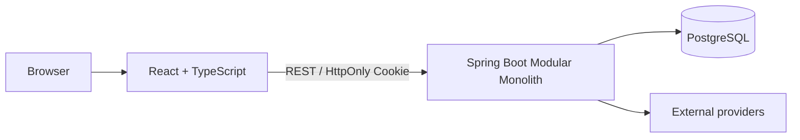

# 아키텍처

## 목적과 문서 경계

이 문서는 backend의 장기 구조 원칙과 module contract를 정의한다. 현재 class·endpoint·module 목록은 code와 각 `package-info.java`가 기준이며, 목표 behavior는 [`requirement/`](requirement/index.md), 구현 convention은 [`backend-development-guide.md`](backend-development-guide.md), test 규칙은 [`backend-test-guide.md`](backend-test-guide.md)가 소유한다. 특정 선택의 이유와 예외는 ADR에 기록한다.

## 시스템 경계



Backend는 하나의 Spring Boot process와 하나의 PostgreSQL schema를 사용하는 Spring Modulith 기반 modular monolith다. Business capability를 독립 module로 나누되 하나의 배포 단위 안에서 local transaction과 명시적인 module seam을 사용한다.

Framework와 dependency의 실제 version은 `build.gradle`, 물리 schema는 Flyway migration, 현재 구현 범위는 checkout된 code와 test를 기준으로 확인한다.

## Application module

- `io.github.metdaisy.amaazon.<module>`의 business-capability package를 application module 경계로 사용한다.
- 각 module root의 `package-info.java`에 `@ApplicationModule(allowedDependencies = ...)`를 선언한다.
- 다른 module은 공개된 `@NamedInterface` 또는 event contract만 사용한다.
- 다른 module의 entity, repository, service 구현 또는 `infra` package를 직접 참조하지 않는다.
- Module graph는 cycle이 없어야 한다. 공통화는 단순 중복 제거가 아니라 안정적인 공유 contract가 있을 때만 수행한다.
- `common`은 business module 간 우회 통로가 아니다. 여러 module이 공유해도 의미와 변경 이유가 같은 작은 기반 type만 둔다.
- `global`은 framework composition과 cross-cutting configuration을 담당하며 business rule을 소유하지 않는다.

`package-info.java`와 이 문서가 다르면 executable source를 현재 사실로 보고 불일치를 수정한다. Module별 현재 dependency 목록을 이 문서에 복제하지 않는다.

## Module 내부 계층

```text
presentation -> application -> domain <- infra
```

- `presentation`은 `application`을 호출한다.
- `application`은 use case를 조정하며 `domain` contract에 의존한다.
- `domain`은 business policy와 persistence·external capability contract를 소유한다.
- `infra`는 `application` 또는 `domain`이 정의한 contract를 구현한다.
- 안쪽 계층은 `presentation` 또는 구체적인 `infra` 구현에 의존하지 않는다.

계층별 class 배치와 Spring convention은 `backend-development-guide.md`가 소유한다.

## Module 간 통신

### 동기 contract

즉시 결과가 필요한 조회·검증·command는 작은 `@NamedInterface`를 사용한다.

- Payload는 상대 module의 내부 model이 아니라 공개 DTO 또는 식별자다.
- 호출 module은 outbound port와 adapter를 사용해 상대 공개 API에 대한 의존을 격리할 수 있다.
- 동기 호출의 failure와 transaction coupling을 caller contract에 명시한다.

### Event

이미 발생한 사실을 알릴 때 event를 사용한다.

- Event는 immutable하고 작은 payload를 가지며 entity를 포함하지 않는다.
- Consumer가 없어도 publisher가 표현한 사실은 성립해야 한다.
- 동기 listener는 publisher의 transaction·failure path에 참여한다.
- Transaction 이후 처리, retry, outbox 또는 asynchronous delivery를 사용할 때 consistency와 idempotency contract를 정한다.
- Command 성격 event는 기본 선택이 아니다. 필요한 경우 결합 이유, failure와 transaction 의미를 ADR에 기록한다.

## Data와 transaction

- Module은 하나의 PostgreSQL schema를 공유하지만 table과 invariant의 business owner는 하나의 module이어야 한다.
- 같은 owning domain 내부 관계에는 foreign key를 사용할 수 있다.
- Module을 넘는 식별자는 DB foreign key로 결합하지 않고 공개 port 또는 event contract로 검증한다.
- Module 내부의 즉시 일관성은 local database transaction으로 보장한다.
- Distributed 또는 장기 workflow는 단계별 transaction, retry, idempotency와 compensation을 명시한다.
- Schema 변경은 새 Flyway migration으로 누적한다. 적용된 migration은 수정하지 않는다.

상세 JPA, repository와 migration 구현 규칙은 `backend-development-guide.md`가 소유한다.

## 외부 system과 security

- 결제, object storage, OAuth provider와 외부 API는 module 안쪽에서 정의한 port 뒤에 둔다.
- 외부 SDK, protocol DTO와 credential은 domain으로 유입시키지 않는다.
- Authentication·authorization은 presentation/security adapter에서 시작하되 resource ownership과 business permission은 application/domain contract로 검증한다.
- Secret, token, password와 내부 오류 detail을 client response, log 또는 document에 노출하지 않는다.

## 구조 검증

- Spring Modulith의 `ApplicationModules.verify()`로 module cycle, 공개 seam과 `allowedDependencies`를 검증한다.
- ArchUnit으로 `presentation -> application -> domain <- infra` dependency 방향을 검증한다. 현재
  `ModularityTest`에 열거된 module만 계층 검증 대상이므로 새 module을 추가할 때 검증 대상도 확장한다.
- Module seam, event, `package-info.java` 또는 계층 package가 바뀌면 구조 검증과 관련 behavior test를 함께 실행한다.
- Module test는 공개 API·event behavior를, repository와 외부 연동은 adapter/integration test를 표면으로 사용한다.

구체적인 test 선택과 assertion은 `backend-test-guide.md`를 따른다.
