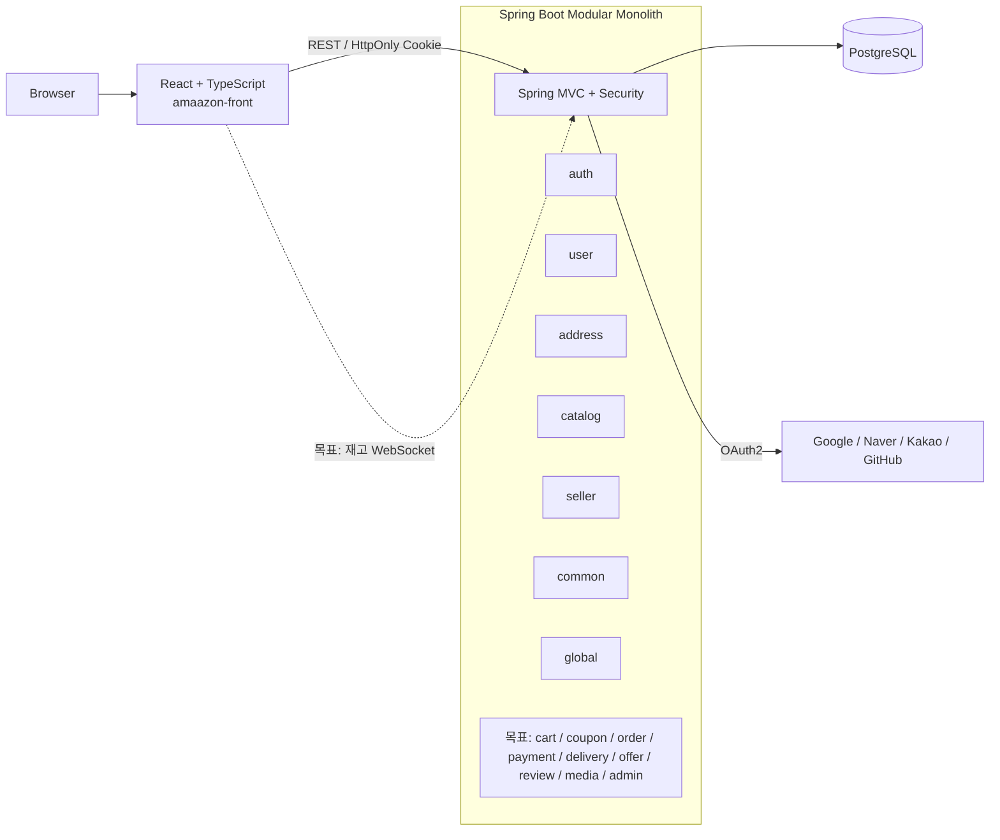
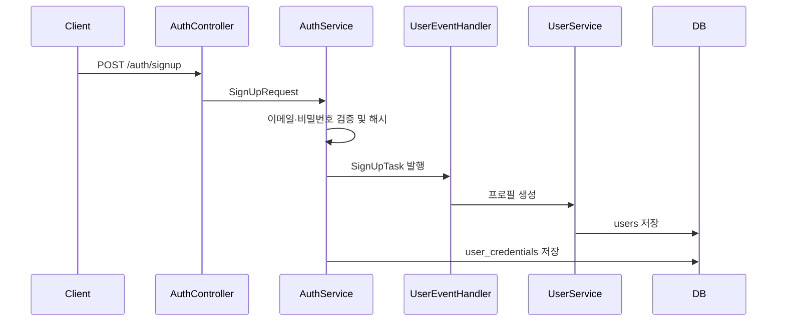

# 아키텍처

## 목적과 범위

하나의 Spring Boot 배포 단위 안에서 도메인별 변경과 검증을 지역화하는 모듈러 모놀리스를 구축한다. 모듈은 작은 공개 인터페이스 뒤에 비즈니스 규칙과 저장 세부사항을 숨기고, 향후 MSA 전환 시 모듈 seam을 서비스 seam으로 발전시킬 수 있어야 한다.

이 문서는 `docs/requirement/index.md`의 목표 구조와 장기간 유지할 구조 원칙을 설명한다. 브랜치, Git SHA, 구현 완료 범위처럼 자주 바뀌는 정보는 `docs/current-state.md`에서 관리한다.

구조, 모듈 seam, 허용 의존성이 바뀔 때만 이 문서를 갱신한다. 선택 이유는 이 문서에 누적하지 않고 ADR에 기록한다.

## 시스템 구성



- 백엔드: Java 17, Spring Boot 3.5.16, Spring Modulith 1.4.12, Spring Data JPA, Flyway, Spring Security.
- 데이터베이스: PostgreSQL. 테스트 환경은 Testcontainers 사용을 전제로 한다.
- 프론트엔드: React 19, TypeScript, Vite, React Router, React Hook Form, Zod.
- 배포 모델: 현재 백엔드와 프론트엔드는 별도 프로젝트 디렉터리지만 백엔드는 하나의 프로세스와 하나의 DB를 사용하는 모듈러 모놀리스다.

## 저장소 구조

```text
src/main/java/io/github/metdaisy/amaazon/
  auth/       인증 수단, 로그인, JWT 연계
  user/       사용자 프로필과 역할
  address/    사용자 배송지 원본과 기본 배송지
  catalog/    카탈로그 상품과 카테고리
  seller/     판매자 조회와 판매자 검증 seam
  common/     모듈 공통 타입과 기반 인터페이스
  global/     보안·웹·캐시·예외·Outbox 기반 설정
src/main/resources/
  db/migration/   Flyway 스키마
src/test/         백엔드 테스트
amaazon-front/    React 프론트엔드
docs/             요구사항, 설계, 상태 문서
```

## 모듈 내부 구조

도메인 모듈은 다음 책임을 따른다.

| 영역 | 책임 |
|---|---|
| `presentation` | HTTP 요청·응답, 인증 주체 추출, 입력 검증 진입점 |
| `application` | 유스케이스 조정, 트랜잭션, 공개 port와 이벤트 처리 |
| `domain` | 엔티티, 값과 상태 전이, 도메인 오류, 저장소 인터페이스 |
| `infra` | JPA, 외부 시스템, 보안 프레임워크 등의 adapter |

호출자는 모듈의 공개 인터페이스만 알아야 한다. JPA 엔티티나 다른 모듈의 `infra` 구현을 직접 참조하지 않는다.

## 현재 모듈과 공개 seam

`package-info.java`에 선언된 현재 허용 의존성은 다음과 같다.

| 모듈 | 책임 | 허용 의존성 |
|---|---|---|
| `common` | 공통 인증 주체, 저장소·매퍼·예외 기반 타입 | 없음 |
| `global` | Spring 설정, 공통 보안/JWT, 캐시, 웹 필터, Outbox 기반 | `common::*` |
| `auth` | 로컬·소셜 인증수단, 토큰, 블랙리스트, 회원가입 진입점 | `common::*`, `user::api`, `global::jwt`, `global::blacklist`, `global::login-policy` |
| `user` | 프로필, 역할, 활성 상태 | `common::*`, `auth::signup`, `auth::password` |
| `catalog` | CatalogProduct·ProductVariant와 카테고리·태그, 카탈로그 조회 | `common::*` |
| `seller` | Seller와 판매자 조회 | `common::*` |

위 표는 기준 SHA에서 코드로 확인한 현재 모듈이다. Offer·Review·Cart·Coupon·Order·Payment·Delivery·P12 Media는 요구사항의 목표 경계이며 현재 구현 모듈로 간주하지 않는다.

현재 공개된 주요 `@NamedInterface`는 다음과 같다.

- `user::api`: 인증 모듈이 사용자 존재 여부, 역할, 활성 상태를 조회하는 동기 seam.
- `UserRolesChangedEvent`, `UserDeactivatedEvent`: User가 역할 변경·계정 비활성화 사실을 발행하고 Auth가 전체 로그인 세션을 무효화하는 공개 이벤트 계약.
- `seller::api`: 카탈로그 모듈이 판매자 존재 여부와 활성 상태를 조회하는 동기 seam.
- 역할 집합은 `USER`(기본 구매자), `PRODUCT_MANAGER`(활성 Seller를 가진 User의 추가 판매자 역할), `ADMIN`(플랫폼 운영자)으로 구성한다. 역할은 독립적으로 보유할 수 있고 `USER`는 다른 역할을 추가해도 유지한다.
- `auth::signup`: `SignUpTask`를 통해 프로필 생성을 요청하는 현재 회원가입 seam.
- `auth::password`: 회원가입 요청의 비밀번호 검증 규칙.
- `global::jwt`: JWT 설정과 생성·검증 기능.
- `global::blacklist`: 토큰 무효화 이벤트.

목표 도메인을 구현할 때의 공개 계약 방향은 다음과 같다.

- `catalog::api`: P9 Offer·P10 Review가 CatalogProduct·ProductVariant의 존재·활성·보관 상태를 검증하는 P2 공개 계약.
- `offer::api`: P9가 고객용 Marketplace 조합에 제공하는 공개 Offer·Inventory 요약.
- `review::api`: P10이 고객용 상품 상세에 제공하는 Review 요약.
- `p12::media-api`와 `common::MediaStoragePort`: P2·P9·P10이 업로드 완료 상태와 저장소 기능만 사용하는 P12 공개 계약.

## 목표 공통 Media Storage 경계

Media 파일은 특정 도메인의 엔티티가 아니라 공통 인프라에 저장한다. 목표 P12 또는 `common` 공개 계약은 모듈이 의존할 수 있는 작은 `MediaStoragePort`를 제공하고, object storage·CDN·파일 삭제 구현은 각 환경의 infra adapter가 담당한다. 이 경계는 현재 구현 완료를 뜻하지 않는다.

- P2는 CatalogProduct Media attachment의 대상 검증, `isPrimary`, `sortOrder`, 공개 여부와 보관 수명주기를 소유한다.
- P9는 판매자별 Offer Media attachment의 대상 검증, 정렬, 공개 여부와 보관 수명주기를 소유한다.
- P10은 Review Media attachment의 Review 연결, 최대 개수, 정렬과 Review 숨김 시 공개 처리 규칙을 소유한다.
- P2와 P10은 서로의 Media 도메인·Repository·infra 구현을 참조하지 않는다. 두 모듈은 `MediaStoragePort`만 사용한다.
- 공통 저장소의 `mediaId`, storage key, public URL은 저장 기술을 추상화한 값이며, Media attachment의 소유자와 허용 규칙은 각 도메인이 검증한다.

## User와 Auth의 프로필 조회 조합

- P1 User는 프로필·역할·활성 상태만 소유하고, P11 Auth가 소유하는 `loginEmail`을 P1 응답에 포함하지 않는다.
- P11 `GET /api/v1/auth/me/credential-summary`는 재인증된 사용자에게만 nullable `loginEmail`을 제공한다. 비밀번호·OAuth 식별자·토큰은 반환하지 않는다.
- SPA CSR 클라이언트는 P1 프로필 조회와 P11 인증수단 요약 조회를 병렬 호출해 화면 모델을 조합한다. 어느 한 요청의 재인증이 실패하면 부분 결과를 표시하지 않고 재인증을 유도한다.
- Auth는 현재 역할·활성 상태 확인을 위해 User의 작은 공개 seam을 동기 조회할 수 있다. User는 단순한 프로필 보강을 위해 Auth를 동기 조회하지 않는다. 복수 클라이언트의 조합이 반복될 때에만 BFF/Account composition API를 도입한다. 자세한 결정은 [ADR-0014](adr/0014-csr-profile-composition-and-auth-user-query-direction.md)를 따른다.

## 현재 회원가입 흐름



- 평문 비밀번호는 `auth` 요청과 검증·해시 범위에 머물며 `SignUpTask`에는 포함되지 않는다.
- Spring의 기본 `@EventListener`는 동기 실행이므로 현재 프로필과 인증수단 생성은 발행자 트랜잭션에 결합되어 있다.
- `SignUpTask`는 완료 사실보다 프로필 생성을 지시하는 명령 성격이 강하다. 이를 유지할지 동기 인터페이스 seam으로 바꿀지는 ADR로 확정해야 한다.
- `auth`와 `user`가 서로의 Named Interface에 의존하므로 새 의존성을 추가하기 전에 순환을 더 키우지 않는지 확인해야 한다.

## 목표 도메인 모듈

| 단계 | 목표 모듈 | 핵심 책임 |
|---|---|---|
| P1 | `user` | 프로필, 권한, 주소, 포인트, 관심상품 |
| P2 | `catalog` | 카테고리, CatalogProduct·ProductVariant, CatalogProduct Media, 판매자·관리자 카탈로그 조회 |
| P3 | `cart` | 활성 장바구니, 항목과 수량, 결제 전 재검증 |
| P4 | `coupon` | 쿠폰 발행·보유·사용·만료 |
| P5 | `order`, `payment`, `delivery` | 금액 산출, 상태 머신, 결제와 환불, 배송 추적 |
| P6 | `outbox`와 Saga 참여 모듈 | 이벤트 유실 방지, 재시도, 멱등 소비, 보상 트랜잭션 |
| P7 | 관리자·운영 진입점 | 관리자 전용 API, 권한 변경, 운영·재처리 기능 |
| P8 | `seller` | 판매자 온보딩, Seller, 판매자 주문 조회 |
| P9 | `offer` | Offer, Inventory, 가격·판매 상태, 고객용 Marketplace 검색·상세 |
| P10 | `review` | Review와 리뷰 Media, 구매·배송 완료 자격 검증 |
| P11 | `auth` | 로컬·소셜 인증수단, 회원가입 인증 흐름, 로그인·로그아웃, 토큰 |
| P12 | `media` 또는 `common` 경계 | `MediaUpload` 업로드 세션·검증·보관과 `MediaStoragePort` 계약을 제공하고, Media attachment의 업무 규칙은 P2·P9·P10이 소유 |

위 표는 목표 분리 단위다. 현재 구현 모듈과 일치하지 않는 목표 모듈은 구현 시 ADR로 분리 수준과 공개 seam을 확정한다. 요구사항의 P 번호가 반드시 하나의 코드 모듈을 뜻하지는 않는다.

## 데이터와 트랜잭션

- 모든 모듈은 현재 하나의 PostgreSQL 스키마를 공유한다.
- `V1__init_schema.sql`은 P1~P10 대상 테이블, P11 인증 지원 테이블, 공통 이미지 저장 메타데이터와 Spring Modulith 기반 테이블을 제공한다. `SignUpSession`·`MediaUpload`의 요구사항 계약이 테이블로 존재한다는 뜻은 아니며, 테이블 존재도 도메인 구현 완료를 의미하지 않는다.
- 스키마 변경은 새 Flyway 마이그레이션으로 적용한다.
- 모듈 내부 원자성은 로컬 DB 트랜잭션으로 보장한다.
- 도메인 간 식별자는 애플리케이션 이벤트 또는 공개 port로 검증하며 DB 외래 키를 만들지 않는다. 외래 키는 같은 도메인 내부 엔티티 관계에만 추가한다.
- P2의 목표 모델은 상품 메타데이터인 `CatalogProduct`와 실제 판매 단위인 `ProductVariant`를 소유한다. P9는 Seller별 가격·판매 조건인 `Offer`와 수량 상태인 `Inventory`, 그리고 Catalog와 Offer를 조합한 고객용 Marketplace 조회를 소유한다. P10은 구매·배송 완료 자격이 필요한 Review와 리뷰 Media를 소유한다.
- P7은 P2~P6 테이블의 소유 모듈이 아니다. 관리자 전용 API는 각 모듈의 공개 application interface를 호출하고, 관리자 권한·운영 진입점만 담당한다.
- P8은 P2의 CatalogProduct·ProductVariant와 P9의 Offer·Inventory를 소유하지 않는다. 판매자는 P8의 Seller 자격으로 P9의 Offer를 관리하고, 주문 데이터는 P5의 공개 interface로 조회한다.
- P11은 인증수단·가입 세션·토큰·로그인 세션을 소유하고, User 프로필·역할·활성 상태는 P1의 공개 계약으로 확인한다. 역할 변경 사실은 P1에서 발행하고 P11이 세션을 무효화한다.
- P12는 `MediaUpload`의 검증·상태와 저장소 계약을 소유한다. P2·P9·P10은 완료된 업로드를 각자의 attachment 규칙으로 연결하며 P12가 업무 소유권을 대신 판단하지 않는다.
- 목표 Outbox는 비즈니스 변경과 이벤트 레코드를 같은 트랜잭션에 기록한다.
- 목표 Saga는 각 단계와 보상을 독립 트랜잭션, 재시도 가능, 멱등하게 처리한다.

## 통신 원칙

- 외부 클라이언트: REST, 목표 재고 알림은 WebSocket.
- 인증: Spring Security Form Login, OAuth2, JWT HttpOnly 쿠키.
- 모듈 간 사실 통지: Spring Application Event.
- 사용자 역할 집합 변경은 `UserRolesChangedEvent`로 통지하고, 이벤트 Outbox 기록은 역할 집합 변경과 같은 트랜잭션으로 저장한다.
- 모듈 간 동기 조회: 필요성이 명확할 때만 작은 Named Interface seam.
- 외부 결제·스토리지: 도메인 인터페이스 뒤의 adapter로 격리한다.
- 이벤트 소비자는 동일 이벤트가 여러 번 전달되어도 결과가 중복되지 않아야 한다. User 비활성화 이벤트의 업무 식별자는 `eventId`이며, Auth는 해당 이벤트를 사용자 단위 세션 무효화로 처리한다.

## 예외 처리

- MVC 요청에서 발생한 예외는 `ApiExceptionHandler`와 `SecurityExceptionHandler`가 받아 `ExceptionStrategyFactory`에서 가장 구체적인 예외 전략을 찾는다.
- 각 전략은 로그 정책, HTTP 상태와 `ExceptionResponse` 응답 본문을 결정한다. 도메인 예외는 `AmaazonErrorCode`의 코드·메시지·오류 유형을 사용한다.
- Spring Security 필터 체인의 인증 실패는 `AuthenticationExceptionEntryPoint`가 `HandlerExceptionResolver`에 위임하여 같은 응답 흐름으로 전달한다. 접근 거부처럼 필터 체인에서 직접 처리하는 경우에도 외부 응답 형식이 달라지지 않도록 경계 테스트로 확인한다.
- `AmaazonException`은 클라이언트용 `clientMessage`와 서버 내부용 `detailMessage`·`logDetails`를 분리한다. `ExceptionResponse`에는 클라이언트 메시지만 포함하고, `getDetailMessage()`를 로그에 기록한다. `toString()`은 예외 로깅에 사용하지 않는다.
- 예외 원문, 토큰, 비밀번호와 내부 구현 정보는 클라이언트 응답에 노출하지 않는다.

## 검증 경계

- Spring Modulith 구조 검증으로 허용하지 않은 의존성을 탐지한다.
- 모듈 테스트는 공개 인터페이스·이벤트를, 저장소·외부 연동은 adapter 통합 테스트를 표면으로 사용한다.
- 상세한 테스트 선택과 Given-When-Then 규칙은 [testing-guide.md](testing-guide.md)를 따른다.
