# Domain ERD

이 문서는 SQL 테이블이 아니라 요구사항과 도메인 객체를 기준으로 작성한 논리 ERD다. 다이어그램에는 현재 구현 객체와 목표 객체를 함께 표시하므로, 구현 여부는 [current-state.md](current-state.md)와 코드·Flyway를 기준으로 판단한다.

- 하나의 통합 Mermaid 다이어그램에서 모든 도메인 필드와 주요 참조관계를 확인한다.
- 영역별 subgraph와 색상을 사용해 P1~P12 관계를 구분한다.
- 객체의 기본 필드는 엔티티 박스에 표시하고, 객체 간 연관 필드는 관계선의 라벨로 표시한다.
- 실선은 같은 도메인 내부 관계, 점선은 모듈 간 논리 참조를 의미한다. 점선은 DB FK를 의미하지 않는다.
- `mappedBy`, `cascade`, `fetch`는 JPA 구현 세부사항이므로 표시하지 않는다.
- 필드의 업무 규칙과 상태값은 [domain-glossary.md](domain-glossary.md), API 계약은 [requirement](requirement/index.md)를 기준으로 한다.

## 통합 도메인 ERD

```mermaid
flowchart LR
    subgraph Identity["P1·P8·P11 사용자 / 인증 / 판매자"]
        direction TB
        User["<b>User</b><br/>id<br/>name<br/>phoneNumber<br/>roles<br/>pointBalance<br/>isEnabled<br/>createdAt<br/>updatedAt"]
        UserRole["<b>UserRole</b><br/>userId<br/>role"]
        UserCredential["<b>UserCredential</b><br/>email<br/>passwordHash<br/>violationCount<br/>untilLocked<br/>createdAt<br/>updatedAt"]
        SocialCredential["<b>SocialCredential</b><br/>id<br/>provider<br/>providerId<br/>createdAt"]
        SignUpSession["<b>SignUpSession</b><br/>id<br/>email<br/>status<br/>otpHash<br/>expiresAt<br/>createdAt<br/>updatedAt"]
        Address["<b>Address</b><br/>id<br/>alias<br/>recipientName<br/>recipientPhone<br/>postalCode<br/>addressLine<br/>isPrimary<br/>lastUsedAt<br/>createdAt<br/>updatedAt"]
        PointHistory["<b>PointHistory</b><br/>id<br/>amount<br/>description<br/>createdAt"]
        RefreshToken["<b>RefreshToken</b><br/>id<br/>deviceId<br/>token<br/>preToken<br/>expiredAt<br/>createdAt<br/>updatedAt"]
        BlacklistToken["<b>BlacklistToken</b><br/>id<br/>token<br/>expiredAt<br/>createdAt"]
        BlacklistUser["<b>BlacklistUser</b><br/>id<br/>user<br/>compromisedAt<br/>createdAt"]
        Seller["<b>Seller</b><br/>id<br/>user<br/>displayName<br/>businessName<br/>businessRegistrationHash<br/>contactEmail<br/>contactPhone<br/>status<br/>reviewedBy<br/>reviewedAt<br/>reviewReason<br/>createdAt<br/>updatedAt"]
        SellerApplication["<b>SellerApplication</b><br/>id<br/>user<br/>businessName<br/>contactEmail<br/>contactPhone<br/>status<br/>seller<br/>createdAt<br/>updatedAt"]
        SellerApplicationReview["<b>SellerApplicationReview</b><br/>id<br/>application<br/>reviewedBy<br/>decision<br/>reasonCode<br/>message<br/>reviewedAt"]
        SellerStatusHistory["<b>SellerStatusHistory</b><br/>id<br/>seller<br/>fromStatus<br/>toStatus<br/>changedBy<br/>reasonCode<br/>message<br/>changedAt"]
        Wishlist["<b>Wishlist</b><br/>id<br/>user<br/>productVariant<br/>createdAt"]

        User -->|"roles ↔ user<br/>1 : N"| UserRole
        User -->|"userCredential ↔ user<br/>1 : 0..1"| UserCredential
        User -->|"socialCredentials ↔ user<br/>1 : N"| SocialCredential
        User -->|"addresses ↔ user<br/>1 : N"| Address
        User -->|"pointHistories ↔ user<br/>1 : N"| PointHistory
        User -->|"refreshTokens ↔ user<br/>1 : N"| RefreshToken
        User -->|"blacklistEntry ↔ user<br/>1 : 0..1"| BlacklistUser
        User -->|"sellerApplications ↔ user<br/>1 : N (pending 0..1)"| SellerApplication
        User -->|"sellers ↔ user<br/>1 : N (active 0..1)"| Seller
        SellerApplication -->|"approvedSeller<br/>0..1 : 1"| Seller
        SellerApplication -->|"reviews<br/>1 : N"| SellerApplicationReview
        Seller -->|"statusHistories<br/>1 : N"| SellerStatusHistory
        User -->|"wishlists<br/>User 1 : Wishlist N"| Wishlist
    end

    subgraph Catalog["P2 상품 / 카탈로그"]
        direction TB
        Category["<b>Category</b><br/>id<br/>parent<br/>name<br/>depth<br/>createdAt<br/>updatedAt"]
        CatalogProduct["<b>CatalogProduct</b><br/>id<br/>category<br/>name<br/>description<br/>brand<br/>asin · gtin · upc<br/>ean · isbn<br/>attributes<br/>publicationStatus<br/>archivedAt<br/>createdAt<br/>updatedAt"]
        ProductVariant["<b>ProductVariant</b> (SQL·목표)<br/>id<br/>catalogProduct<br/>sku<br/>displayName<br/>weight<br/>dimensions<br/>createdAt<br/>updatedAt"]
        Tag["<b>Tag</b><br/>id<br/>name<br/>createdAt"]
        CatalogProductTag["<b>CatalogProductTag</b><br/>id<br/>catalogProduct<br/>tag<br/>createdAt"]

        Category -->|"Category 1 : Category N<br/>parent · childCategories"| Category
        Category -->|"Category 1 : CatalogProduct N<br/>catalogProducts"| CatalogProduct
        CatalogProduct -->|"CatalogProduct 1 : ProductVariant N<br/>variants"| ProductVariant
        CatalogProduct -->|"CatalogProduct 1 : CatalogProductTag N<br/>tags"| CatalogProductTag
        Tag -->|"Tag 1 : CatalogProductTag N<br/>catalogProducts"| CatalogProductTag
    end

    subgraph OfferDomain["P9 Offer / Marketplace"]
        direction TB
        Offer["<b>Offer</b><br/>id<br/>productVariant<br/>seller<br/>basePrice<br/>discountPrice<br/>currency<br/>discountStartAt<br/>discountEndAt<br/>status<br/>inactiveSource<br/>createdAt<br/>updatedAt"]
        Inventory["<b>Inventory</b><br/>id<br/>offer<br/>quantity<br/>updatedAt"]
        Offer -->|"Offer 1 : Inventory 1<br/>inventory"| Inventory
    end

    subgraph ReviewDomain["P10 Review"]
        direction TB
        Review["<b>Review</b><br/>id<br/>offer<br/>user<br/>rating<br/>content<br/>createdAt"]
    end

    ProductVariant -.->|"P9 공개 Catalog 계약<br/>ProductVariant 1 : Offer N"| Offer
    Offer -.->|"Offer 1 : Review N<br/>구매한 Offer 귀속"| Review

    subgraph SharedMedia["P12 Media 업로드 / 공통 저장 인프라"]
        direction TB
        MediaUpload["<b>MediaUpload</b><br/>id<br/>requesterUserId<br/>mediaType<br/>declaredSize<br/>checksum<br/>storageKey<br/>status<br/>expiresAt<br/>createdAt"]
        MediaAttachment["<b>MediaAttachment</b><br/>id<br/>ownerType · ownerId<br/>mediaId<br/>publicUrl<br/>isPrimary<br/>sortOrder<br/>status<br/>createdAt"]
        MediaStorage["<b>MediaStorage</b><br/>object storage · CDN"]
        MediaUpload --> MediaStorage
        MediaAttachment --> MediaStorage
    end

    MediaUpload -.->|"READY upload 1 : 0..1<br/>one-time attachment"| MediaAttachment
    CatalogProduct -.->|"CatalogProduct 1 : MediaAttachment N<br/>catalog attachment"| MediaAttachment
    Offer -.->|"Offer 1 : MediaAttachment N<br/>seller listing attachment"| MediaAttachment
    Review -.->|"Review 1 : MediaAttachment N<br/>review attachment"| MediaAttachment

    subgraph Shopping["P3 장바구니 / P4 쿠폰"]
        direction TB
        Cart["<b>Cart</b><br/>id (userId or guest UUID)<br/>expiresAt? (guest)<br/>createdAt<br/>updatedAt"]
        CartItem["<b>CartItem</b><br/>id<br/>cart<br/>offer<br/>quantity<br/>createdAt<br/>updatedAt"]
        Coupon["<b>Coupon</b><br/>id<br/>name<br/>discountType<br/>discountValue<br/>maxDiscountAmount<br/>minimumOrderAmount<br/>currency<br/>totalQuantity<br/>issuedQuantity<br/>status<br/>validFrom<br/>validUntil<br/>createdAt<br/>updatedAt"]
        UserCoupon["<b>UserCoupon</b><br/>id<br/>user<br/>coupon<br/>status<br/>usedAt<br/>createdAt<br/>updatedAt"]

        Cart -->|"items ↔ cart<br/>1 : N"| CartItem
        Coupon -->|"userCoupons ↔ coupon<br/>1 : N"| UserCoupon
    end

    subgraph Commerce["P5 주문 / 결제 / 배송"]
        direction TB
        Order["<b>Order</b><br/>id<br/>user<br/>checkoutKey<br/>pointUsedAmount<br/>status<br/>expiresAt<br/>subtotalAmount<br/>discountAmount<br/>paidAmount<br/>shippingRecipientName<br/>shippingRecipientPhone<br/>shippingPostalCode<br/>shippingAddressLine<br/>createdAt<br/>updatedAt<br/>canceledAt"]
        OrderItem["<b>OrderItem</b><br/>id<br/>order<br/>offer<br/>userCoupon<br/>catalogProductName<br/>variantDisplayName<br/>quantity<br/>unitPrice<br/>subtotal<br/>couponDiscountAmount<br/>createdAt"]
        PaymentMethod["<b>PaymentMethod</b><br/>id<br/>user<br/>methodType<br/>provider<br/>maskedNumber<br/>createdAt<br/>updatedAt"]
        Payment["<b>Payment</b><br/>id<br/>order<br/>paymentMethod<br/>transactionId<br/>status<br/>amount<br/>failureCode<br/>requestedAt<br/>completedAt<br/>createdAt<br/>updatedAt"]
        Delivery["<b>Delivery</b><br/>id<br/>order<br/>status<br/>deliveryStatusUpdatedAt<br/>createdAt<br/>updatedAt"]

        Order -->|"items ↔ order<br/>1 : N"| OrderItem
        Order -->|"payments ↔ order<br/>1 : N"| Payment
        PaymentMethod -->|"payments ↔ paymentMethod<br/>1 : N"| Payment
        Order -->|"delivery ↔ order<br/>1 : 0..1"| Delivery
    end

    subgraph Reliability["P6 이벤트 / Saga"]
        direction TB
        OutboxEvent["<b>OutboxEvent</b><br/>id<br/>aggregateType<br/>aggregateId<br/>eventType<br/>payload<br/>status<br/>retryCount<br/>createdAt<br/>publishedAt<br/>lastError"]
        EventConsumption["<b>EventConsumption</b><br/>id<br/>event<br/>consumer<br/>status<br/>processedAt<br/>createdAt"]
        SagaInstance["<b>SagaInstance</b><br/>id<br/>order<br/>status<br/>createdAt<br/>updatedAt"]
        SagaStep["<b>SagaStep</b><br/>id<br/>saga<br/>name<br/>status<br/>retryCount<br/>completedAt<br/>lastError<br/>createdAt<br/>updatedAt"]
        EventPublication["<b>EventPublication</b><br/>id<br/>completionAttempts<br/>completionDate<br/>eventType<br/>lastResubmissionDate<br/>listenerId<br/>publicationDate<br/>serializedEvent<br/>status"]

        OutboxEvent -->|"consumptions ↔ event<br/>1 : N"| EventConsumption
        SagaInstance -->|"steps ↔ saga<br/>1 : N"| SagaStep
    end

    User -.->|"manager"| CatalogProduct
    User -.->|"user"| Review
    User -.->|"logical owner via cart.id"| Cart
    User -.->|"user"| UserCoupon
    User -.->|"user"| Order
    User -.->|"user"| PaymentMethod
    Seller -.->|"seller"| Offer
    ProductVariant -.->|"productVariant"| Wishlist
    Offer -.->|"offer"| CartItem
    Offer -.->|"offer"| OrderItem
    UserCoupon -.->|"appliedCoupon"| OrderItem
    Address -.->|"shippingAddress"| Order
    Order -.->|"order"| SagaInstance
    Order -.->|"order"| Payment
    Order -.->|"order"| Delivery
    CatalogProduct -.->|"snapshot"| OrderItem
    ProductVariant -.->|"snapshot"| OrderItem

    classDef identity fill:#e8f1ff,stroke:#4f7cac,color:#17324d
    classDef catalog fill:#eaf7ee,stroke:#4b9560,color:#193b25
    classDef shopping fill:#fff4df,stroke:#c58a2b,color:#4d3210
    classDef commerce fill:#ffe8e8,stroke:#b65c5c,color:#4d1717
    classDef reliability fill:#eee8ff,stroke:#7662ad,color:#2d2452
    classDef shared fill:#f0f0f0,stroke:#777,color:#222
    classDef offer fill:#fff0d9,stroke:#b8791c,color:#4a2d08
    classDef review fill:#f7e5f5,stroke:#9b4c91,color:#401d3b

    class User,UserRole,UserCredential,SocialCredential,SignUpSession,Address,PointHistory,RefreshToken,BlacklistToken,BlacklistUser,Seller,SellerApplication,SellerApplicationReview,SellerStatusHistory,Wishlist identity
    class Category,CatalogProduct,ProductVariant,Tag,CatalogProductTag catalog
    class Offer,Inventory offer
    class Review review
    class MediaUpload,MediaAttachment,MediaStorage shared
    class Cart,CartItem,Coupon,UserCoupon shopping
    class Order,OrderItem,PaymentMethod,Payment,Delivery commerce
    class OutboxEvent,EventConsumption,SagaInstance,SagaStep,EventPublication reliability
```

## 관계와 저장 방식 해석

`OrderSession`은 주문의 영속 도메인 데이터가 아니라 단일 인스턴스의 Caffeine에만 보관되는 일시적인 주문 화면 점유 정보이므로 ERD에서 제외한다. 다중 인스턴스 전환 시에는 Caffeine 저장소를 Redis로 교체한다.

- `Category.childCategories`는 Category의 자기참조이고, `Category.catalogProducts`는 대표 Category를 통한 일대다 관계다.
- `CatalogProduct`는 단일 `categoryId`를 저장한다. 상품 화면의 전체 Category 경로는 연결된 Category에서 `parentId`를 따라 계산한다.
- Category 검색은 선택한 Category와 하위 Category ID를 P2가 계산한 뒤 해당 `category_id`를 기준으로 조회한다.
- `CatalogProduct`와 `ProductVariant`는 `1 : N` 관계다. 하나의 CatalogProduct가 여러 ProductVariant를 가지며, 각 ProductVariant는 하나의 CatalogProduct에 속한다.
- `Category`, `MediaAttachment`은 CatalogProduct의 메타데이터·전시 정보와 연결된다.
- `MediaUpload`는 P12가 소유하는 일회성 업로드 세션이며 `READY` 상태에서 한 번만 `MediaAttachment`로 연결된다. P2·P9·P10은 각자의 attachment 규칙을 소유하고, SQL의 `images.entity_type`, `images.entity_id`가 소유 대상을 구분한다.
- `Offer.seller`, `Review.user`, `Wishlist.user`, `Order.user` 등 점선 관계는 모듈 간 논리 참조다. DB FK 대신 공개 애플리케이션 계약으로 검증한다. 현재 CatalogProduct에는 `managerId`가 없다.
- `Offer`와 `Review`는 `1 : N` 관계다. 리뷰는 구매자가 실제 구매한 판매 조건인 Offer에 속하며, 상품 상세 화면에서 여러 Offer의 리뷰를 통합할지는 P9 read model이 결정한다.
- 현재 V1 마이그레이션의 `reviews.variant_id`와 `(user_id, variant_id)` 유니크 인덱스는 이전 모델의 흔적이므로, Offer 귀속으로 전환할 때 별도 스키마 마이그레이션이 필요하다.
- `User`와 `Wishlist`는 P1 내부의 `1 : N` 관계이며, `ProductVariant`와 `Wishlist`의 점선 관계는 관심 대상인 실제 구매 단위를 나타낸다.
- `OrderItem`의 상품·옵션·Offer 참조는 주문 당시 대상을 식별하기 위한 논리 참조이며, 상품명·Variant 표시명·가격은 스냅샷 필드로 보존한다.
- `Order`는 최종 결제 시 선택한 Address의 값을 `shipping*` 필드에 스냅샷으로 저장한다. `PENDING` 주문에서는 아직 배송지 스냅샷이 없을 수 있다.
- `EventPublication`은 Spring Modulith의 이벤트 발행 지원 객체이며, 업무 도메인 엔티티를 대체하지 않는다.
- Access Token과 Guest Token은 영속 도메인 객체가 아니다. `Login Session`은 Access Token과 기기별 RefreshToken 생명주기를 묶은 논리 개념이다. 구매 가능 상태는 Offer와 Inventory를 조합해 계산한다.

추가 cardinality 규칙:

- `BlacklistUser`는 사용자당 하나만 존재한다.
- `SellerApplication`·`SellerApplicationReview`·`SellerStatusHistory`는 P8 목표 객체다. 현재 Java 모듈과 V1 테이블에서는 확인되지 않는다.
- `Seller`는 승인된 판매자 프로필이므로 User와 `1:0..1`이며, `User.userId`에 연결된 Seller는 하나만 허용한다.
- `SellerApplicationReview`는 목표 신청 승인·거절 이력, `SellerStatusHistory`는 목표 Seller 정지·재활성화 이력이다.
- `UserCredential.passwordHash`는 SQL의 `user_credentials.password_hash`에 저장한다.
- `SellerApplication`은 목표 P8에서 회사명과 연락처를 보관하는 간단한 판매자 신청 원본이다. 현재 구현에는 없다.
- `SignUpSession`은 목표 P11 객체다. 현재 Java 엔티티와 V1~V5 테이블에서는 확인되지 않는다.

## P7 관리자

관리자는 별도 `Admin` 엔티티를 만들지 않고 `User.roles`의 `ADMIN` 값으로 표현한다. 관리 대상은 목표 범위까지 포함해 Category, CatalogProduct, Coupon, Seller, Delivery, OutboxEvent, SagaInstance이며 각 도메인의 소유권은 유지한다.

## SQL 스키마와의 차이

실제 테이블·컬럼·자료형·제약 조건은 [V1__init_schema.sql](../src/main/resources/db/migration/V1__init_schema.sql)와 후속 V2~V5 migration을 기준으로 한다. 현재 Java 구현은 User·Credential·Address·Category·CatalogProduct·Seller 중심이며, SignUpSession·MediaUpload·SellerApplication 등은 ERD의 목표 객체다. Domain ERD의 객체 수와 SQL 테이블 수는 연결 엔티티·모듈 경계·프레임워크 지원 객체 때문에 일대일로 대응하지 않을 수 있다.
